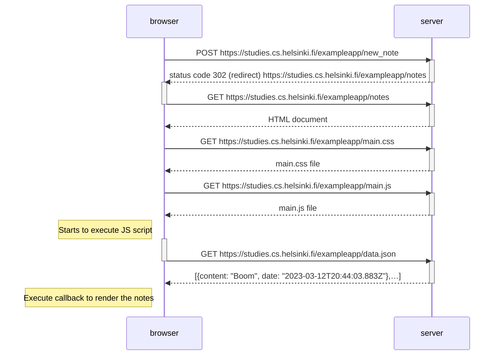

```mermaid
sequenceDiagram
    participant browser
    participant server

    browser->>server: POST https://studies.cs.helsinki.fi/exampleapp/new_note

    activate server
    server-->>browser: status code 302 (redirect) https://studies.cs.helsinki.fi/exampleapp/notes
    deactivate server

    activate browser
    browser ->> server: GET https://studies.cs.helsinki.fi/exampleapp/notes
    deactivate browser

    activate server
    server-->>browser: HTML document
    deactivate server

    browser->>server: GET https://studies.cs.helsinki.fi/exampleapp/main.css
    activate server
    server-->>browser: main.css file
    deactivate server

    browser->>server: GET https://studies.cs.helsinki.fi/exampleapp/main.js

    activate server
    server-->>browser: main.js file
    deactivate server
    Note left of browser: Starts to execute JS script
    

    activate browser
    browser->>server: GET https://studies.cs.helsinki.fi/exampleapp/data.json
    deactivate browser

    activate server
    server-->>browser: [{content: "Boom", date: "2023-03-12T20:44:03.883Z"},…]
    deactivate server
    Note left of browser: Execute callback to render the notes 

    activate server
```
