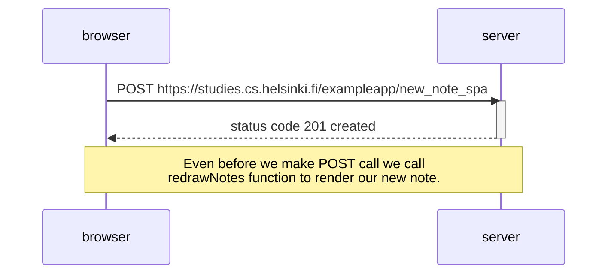

```mermaid
sequenceDiagram
    participant browser
    participant server

    browser->>server: POST https://studies.cs.helsinki.fi/exampleapp/new_note_spa
    
    activate server
    server-->>browser: status code 201 created
    deactivate server

    Note over browser,server: Even before we make POST call we call<br/>redrawNotes function to render our new note.
```
